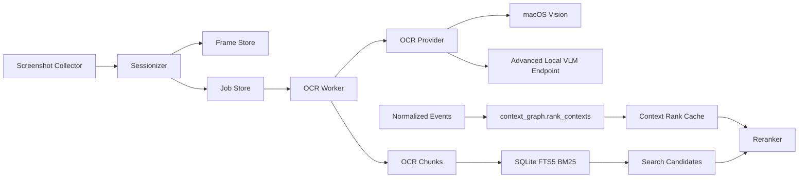
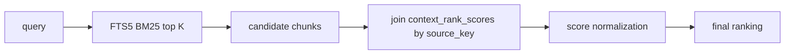

# Screen Text Search backend 설계안: OCR, BM25, Context Rank

이 문서는 Screen Text Search의 backend 설계와 개발자용 advanced OCR backend 운영 방법을 정리합니다. 제품 MVP 경로는 사용자가 명시적으로 켠 뒤 macOS Vision 기반 OCR provider(`macos_vision`)를 사용하며, vLLM이나 별도 모델 서버가 필요하지 않습니다.

검색 파이프라인은 embedding/vector DB를 사용하지 않고, provider가 추출한 화면 텍스트를 SQLite FTS5 BM25 검색과 context graph PageRank 점수로 조합합니다. local vLLM/OpenAI-compatible VLM backend는 provider interface 뒤에 남겨 둔 고급 개발자 경로이며, smoke test와 provider 교체 검증에 사용합니다.

## 현재 구현 상태와 롤아웃 경계

Screen Text Search는 제품 설정에서 기본값이 꺼져 있습니다. 사용자는 데스크톱 앱의 Recording 패널 또는 `screenText.updateSettings` RPC를 통해 명시적으로 opt-in해야 합니다. 별도 provider 설정이 없으면 제품 기본 provider는 macOS Vision입니다.

아래 env flag는 개발자 override입니다. 제품 경로의 유일한 enablement 수단으로 쓰지 않습니다. local vLLM smoke test처럼 고급 backend를 검증할 때만 명시적으로 켭니다.

```bash
export MELONE_SCREENSHOT_COLLECTOR_ENABLED=true
export MELONE_SCREEN_SEARCH_WORKERS_ENABLED=true
export MELONE_VLM_PROVIDER=local_vllm
export MELONE_VLM_ENDPOINT=http://127.0.0.1:8000/v1
export MELONE_VLM_MODEL=lightonai/LightOnOCR-2-1B
export MELONE_VLM_TIMEOUT_SECONDS=120
```

현재 screen search 관련 env와 기본값은 다음과 같습니다.

| Env | Default | Notes |
| --- | --- | --- |
| `MELONE_SCREENSHOT_COLLECTOR_ENABLED` | unset | 개발자 override입니다. unset이면 persistent Screen Text Search 설정을 따릅니다. |
| `MELONE_SCREEN_SEARCH_WORKERS_ENABLED` | unset | 개발자 override입니다. unset이면 persistent Screen Text Search 설정을 따릅니다. |
| `MELONE_SCREEN_SEARCH_MAX_JOBS_PER_TICK` | `2` | 한 collector tick에서 처리할 finalize/OCR job 수입니다. |
| `MELONE_SCREEN_SEARCH_RETRY_BACKOFF_SECONDS` | `60` | retryable OCR failure의 고정 backoff입니다. |
| `MELONE_SCREEN_SEARCH_HIGH_BACKLOG_THRESHOLD` | `20` | capture interval을 2배로 늘리는 backlog 기준입니다. |
| `MELONE_SCREEN_SEARCH_VERY_HIGH_BACKLOG_THRESHOLD` | `100` | transition-frame-only capture로 전환하는 backlog 기준입니다. |
| `MELONE_SCREEN_TEXT_RETAIN_SCREENSHOTS` | `false` | 개발/debug용입니다. 기본 제품 정책은 성공적으로 인덱싱된 원본 PNG 삭제입니다. |
| `MELONE_VLM_PROVIDER` | `macos_vision` | `macos_vision`이 제품 기본입니다. `mock`, `local_vllm`, `vllm`, `mlx_vlm`, `local_openai` 계열은 테스트/advanced backend 용도입니다. |
| `MELONE_VLM_ENDPOINT` | `http://127.0.0.1:8000/v1` | local OpenAI-compatible advanced backend를 선택했을 때만 image data URL을 보내는 base URL입니다. |
| `MELONE_VLM_MODEL` | `lightonai/LightOnOCR-2-1B` | local advanced backend에 전달할 model 이름입니다. |
| `MELONE_VLM_TIMEOUT_SECONDS` | `120` | provider request timeout입니다. |
| `MELONE_VLM_MAX_TOKENS` | `4096` | local OpenAI-compatible advanced backend max tokens입니다. |

`screenshot_min_interval_seconds`는 현재 env가 아니라 `ServiceConfig` 기본값 10초입니다.

구현된 로컬 파이프라인은 다음 순서로 동작합니다.

1. `melone start` 또는 `melone start --foreground`가 기존 event collector를 실행합니다.
2. Screen Text Search가 persistent setting 또는 development override로 enabled이면 매 collector tick에서 최신 context event를 `screen_sessions`로 반영합니다.
3. Screen Text Search가 enabled이면 열린 session에 대해 macOS screenshot을 캡처하고 `$MELONE_HOME/screenshots/<session_id>/<captured_at>-<frame_id>.png`에 저장합니다.
4. context가 바뀌어 session이 닫히면 `session_finalize` job이 keyframe/crop OCR job을 만듭니다.
5. `frame_ocr`/`crop_ocr` job은 configured OCR provider로 이미지를 처리하고, 추출 text를 `ocr_chunks`와 `ocr_chunks_fts`에 저장합니다. 제품 기본 provider는 macOS Vision이고, local OpenAI-compatible VLM provider를 선택한 경우에만 image bytes가 configured endpoint로 전송됩니다.
6. context rank cache는 worker tick 또는 `melone context-rank-cache refresh`로 갱신합니다.
7. `melone search <query> --limit <n>`은 FTS5 BM25 후보와 context rank cache를 조합해 결과를 출력합니다.

`screenText.status`는 `off`, `blocked`, `ready`, `indexing`, `error` 상태와 Screen Recording 권한, provider availability, backlog, 최신 인덱싱 시각을 반환합니다. `melone status`는 pending/running/dead OCR job 수, 최신 context-rank 계산 시각, screenshot collector enablement, runtime path를 보여줍니다.

### Advanced local VLM smoke test

이 절차는 개발자가 local OpenAI-compatible VLM backend를 검증할 때만 사용합니다. 제품 MVP 경로는 macOS Vision provider를 사용하므로 vLLM server가 필요하지 않습니다.

한 터미널에서 local vLLM server를 띄웁니다.

```bash
vllm serve lightonai/LightOnOCR-2-1B \
  --host 127.0.0.1 \
  --port 8000 \
  --limit-mm-per-prompt '{"image": 1}' \
  --mm-processor-cache-gb 0 \
  --no-enable-prefix-caching
```

다른 터미널에서 개발용 데이터 경로, Screen Text Search 개발자 override, advanced backend provider를 지정하고 foreground로 실행합니다.

```bash
export MELONE_HOME=/tmp/melone-screen-search-dev
export MELONE_SCREENSHOT_COLLECTOR_ENABLED=true
export MELONE_SCREEN_SEARCH_WORKERS_ENABLED=true
export MELONE_VLM_PROVIDER=local_vllm
export MELONE_VLM_ENDPOINT=http://127.0.0.1:8000/v1
export MELONE_VLM_MODEL=lightonai/LightOnOCR-2-1B
export MELONE_VLM_TIMEOUT_SECONDS=120

melone start --foreground
```

macOS에서 Screen Recording과 Accessibility 권한이 허용된 상태로 앱/브라우저 창을 몇 번 전환합니다. session은 context가 바뀔 때 닫히므로, 한 화면만 계속 보고 있으면 finalize/OCR job이 생기지 않을 수 있습니다.

서비스를 잠시 실행한 뒤 다른 터미널에서 같은 `MELONE_HOME`을 사용해 상태와 검색을 확인합니다.

```bash
export MELONE_HOME=/tmp/melone-screen-search-dev

melone status
melone context-rank-cache refresh --event-limit 1000
melone search "검색할 화면 텍스트" --limit 10
```

### 민감 데이터와 모델 호출 경계

- Screenshot PNG는 캡처 직후 `$MELONE_HOME/screenshots/<session_id>/...png`에 저장됩니다. 기본 제품 정책에서는 성공적으로 text extraction과 indexing이 끝난 원본 PNG를 삭제하고, retryable/dead job 입력은 재시도와 debugging을 위해 명시적으로 보존합니다.
- OCR text와 keyboard event 일부 text는 `$MELONE_HOME/melone.sqlite`에 저장됩니다.
- 제품 기본 `macos_vision` provider는 별도 vLLM server를 사용하지 않습니다.
- `local_vllm`, `vllm`, `mlx_vlm`, `local_openai` 같은 local OpenAI-compatible advanced backend를 선택하면 image bytes가 data URL 형태로 `MELONE_VLM_ENDPOINT`에 HTTP 전송될 수 있습니다. 위 smoke test 예시는 `127.0.0.1`에만 보내는 로컬 경로입니다.
- cloud VLM endpoint, vector DB, bbox OCR provider 확장은 현재 구현 범위 밖입니다. `MELONE_VLM_ENDPOINT`를 외부 주소로 바꾸면 화면 이미지가 로컬 머신 밖으로 나갈 수 있으며, 이는 현재 제품 guardrail 밖입니다.
- `DenylistSensitiveScreenPolicy` hook은 코드에 있지만 CLI/env로 관리되는 denylist는 아직 없습니다. 민감 화면을 보는 동안에는 screenshot collector feature flag를 켜지 마세요.

## 목표

- 사용자 화면을 URI/app/window session 단위로 기록합니다.
- 비슷한 화면은 diff/dedupe로 줄이고, 의미 있는 keyframe 또는 crop만 OCR 대상으로 보냅니다.
- 제품 기본값은 macOS Vision provider로 화면 텍스트를 추출합니다.
- local vLLM/OpenAI-compatible provider는 advanced developer backend로 유지합니다.
- 추출 텍스트는 SQLite FTS5 BM25 기반으로 검색합니다.
- BM25 후보 결과에 `context_graph.py`의 PageRank 점수를 반영해 재랭킹합니다.
- OCR provider 호출부는 interface 뒤로 캡슐화해, 이후 다른 로컬 모델이나 backend로 바꿀 수 있게 합니다.

## Scope

### In

- URI/app/window sessionization
- screenshot/keyframe/crop 입력 생성과 성공 후 원본 삭제 정책
- diff/dedupe 기반 OCR job 생성
- macOS Vision provider
- advanced local OpenAI-compatible VLM adapter
- OCR 결과 저장
- SQLite FTS5 BM25 index
- context PageRank score cache
- BM25 + PageRank reranking

### Out

- Vector DB
- embedding 기반 semantic search
- 실시간 OCR
- 모델 fine-tuning
- bbox OCR 모델 의존

## 전체 구조



## 용어

- `session`: 하나의 URI, app window, 또는 app context가 활성 상태인 시간 구간입니다.
- `frame`: 특정 시점에 저장한 원본 screenshot입니다.
- `keyframe`: 중복 제거 후 session을 대표하는 OCR 대상 frame입니다.
- `crop`: diff 결과로 추출한 변경 영역입니다.
- `chunk`: OCR 결과를 검색 가능한 단위로 자른 텍스트 조각입니다.
- `source_key`: PageRank join에 사용하는 context key입니다.
- `retrieval_locator`: 검색 결과가 실제로 가리키는 URL/window locator입니다.

## URI Session 전략

현재 코드베이스에는 context graph 입력을 만드는 흐름이 있습니다.

- `apps/service/melone_service/pipeline/context_pages.py`
  - `ContextUnit`
  - `ContextPage`
  - `build_context_units()`
  - `normalize_context_page()`
- `apps/service/melone_service/pipeline/context_graph.py`
  - `rank_contexts()`
  - `page_rank()`

화면 캡처 session도 이 개념에 맞춥니다.

1. active app/window 변경 또는 current asset URL 변경을 감지합니다.
2. `ContextUnit`에 준하는 `session`을 엽니다.
3. 같은 `retrieval_locator`가 유지되는 동안 frame을 누적합니다.
4. app/window/URI가 바뀌면 이전 session을 닫습니다.
5. 닫힌 session에 대해 `session_finalize` job을 생성합니다.

브라우저 URL은 `url:<normalized_url>` 형태의 `retrieval_locator`를 사용합니다. URL이 없는 일반 앱은 `app_window:<app>:<title>` 또는 `app:<app>` key를 사용합니다.

세션의 `source_key`와 `retrieval_locator`는 직접 문자열을 조립하지 않고, `ContextUnit`을 만들어 `normalize_context_page()`를 통과시켜 얻습니다. URL 정규화, GitHub repo 묶기, low-signal 처리가 ranking 쪽과 100% 동일해야 join이 깨지지 않기 때문입니다.

## Screenshot Collector

현재 구현에는 `ScreenshotCollector`가 있으며, fresh install 기본값은 비활성입니다. persistent Screen Text Search 설정을 켜거나 `MELONE_SCREENSHOT_COLLECTOR_ENABLED=true` 개발자 override를 지정했을 때 기존 collector loop에 추가됩니다. `ActiveWindowCollector`와 current asset collector가 만든 context event를 worker가 `screen_sessions`로 묶고, screenshot collector는 열린 session이 있을 때만 frame을 저장합니다.

### 책임

1. 일정 주기로 현재 화면(또는 foreground window)을 캡처한다.
2. 캡처 시점의 active app/window/URL 컨텍스트를 frame에 붙인다.
3. 직전 frame과 sha256이 같으면 저장을 건너뛴다(정적 화면 dedupe).
4. 민감 앱/화면이면 디스크에 쓰기 전에 캡처를 건너뛴다.
5. 이미지 파일을 `screenshots_dir`에 쓰고 `screen_frames`에 row를 추가한다.

### 캡처 방식 (macOS 우선)

- `ActiveWindowCollector`처럼 darwin에서만 동작하고, 다른 platform에서는 빈 결과를 반환한다.
- 현재 macOS 구현은 `/usr/sbin/screencapture -x -t png`를 thin protocol 뒤에서 호출한다. 테스트에서는 fake capture API를 주입한다.
- 이미지는 PNG로 저장하고, 파일 경로는 `screenshots_dir/<session_id>/<captured_at>-<frame_id>.png` 형태로 둔다.
- `width`, `height`, `sha256`은 캡처 시점에 계산한다. `perceptual_hash`는 fake capture 또는 이후 확장 지점에서 저장할 수 있고, `diff_score`는 finalize 단계에서 확정한다.

### 권한

- 화면 캡처는 macOS Screen Recording(TCC) 권한이 필요하다.
- `permissions.py`는 `screen_recording` 권한을 필수 권한으로 점검하고, `screenshot` collector 상태를 `melone status`에 표시한다.
- 권한이 없으면 `melone start`가 실패한다. 캡처 API가 개별 tick에서 실패하는 경우 screenshot collector는 빈 결과를 반환하고 수집 루프 전체는 계속 돈다.

### 수집 루프 통합

- 기존 collector loop(`main._run_collector_loop`)은 `polling_interval_seconds`(기본 1s) 주기의 단일 thread다.
- screenshot 캡처는 더 느린 주기로 돌아야 하므로, collector 내부에서 `screenshot_min_interval_seconds`(기본 10s)로 throttle한다. 매 tick 호출되지만 interval이 지나지 않았으면 즉시 빈 결과를 반환한다.
- 이렇게 하면 새 thread 없이 기존 단일 loop에 캡처를 얹을 수 있다. backlog가 늘 때 interval을 늘리는 정책은 "Scheduling > Capture loop"를 따른다.
- OCR worker / session finalize / context rank worker는 캡처와 분리된 백그라운드 작업이며, DB 동시성 정책은 "SQLite 동시성"을 따른다.

## OCR Worker

코드의 기존 저장소와 worker 명칭에는 `vlm_jobs`, `VlmOcrClient`, `vlm_worker`가 남아 있습니다. 현재 제품 경로에서는 provider가 macOS Vision일 수 있으므로 이 명칭은 backend history와 interface 이름으로만 이해합니다. 사용자-facing 문구에서는 Screen Text Search와 screen text를 사용합니다.

`vlm_worker`의 책임은 다음과 같습니다.

1. pending OCR job을 가져옵니다.
2. image path와 crop bbox를 확인합니다.
3. 필요하면 crop/preprocess image를 만듭니다.
4. `VlmOcrClient` interface를 통해 OCR을 요청합니다.
5. 결과 text를 normalize/dedupe합니다.
6. `ocr_chunks`에 저장합니다.
7. SQLite FTS5 index를 갱신합니다.

worker는 provider 구현을 몰라야 합니다. worker가 아는 것은 `VlmOcrClient.extract_text()` 계약뿐이어야 합니다.

## OCR provider 호출 추상화

### Port

```python
from dataclasses import dataclass
from pathlib import Path
from typing import Protocol


@dataclass(frozen=True)
class VlmOcrRequest:
    image_path: Path
    prompt: str
    crop_bbox: tuple[int, int, int, int] | None = None
    request_id: str | None = None
    timeout_seconds: float | None = None


@dataclass(frozen=True)
class VlmOcrResult:
    text: str
    model: str
    provider: str
    latency_ms: int
    raw_response_json: str | None = None


class VlmOcrClient(Protocol):
    def extract_text(self, request: VlmOcrRequest) -> VlmOcrResult:
        ...
```

### Adapters

현재 구현된 provider는 다음과 같습니다.

```text
MacosVisionOcrClient
- provider: macos_vision
- product-default provider
- macOS Vision framework로 local text extraction
- no vLLM server required
```

```text
LocalVllmOcrClient
- endpoint: http://127.0.0.1:8000/v1/chat/completions
- model: lightonai/LightOnOCR-2-1B
- advanced/developer backend
- image input: data URL 변환 후 configured endpoint로 전송
- output: plain text
```

```text
MockVlmOcrClient
- 테스트용 deterministic response
- worker, scheduler, indexing 테스트에서 사용
```

나중에 추가 가능한 adapter는 다음과 같습니다. 아래 항목은 현재 제품 MVP 범위 밖입니다.

```text
CloudVlmOcrClient
- OpenAI-compatible cloud endpoint
- vendor-specific auth header
- 같은 VlmOcrClient contract 유지
- image bytes가 로컬 머신 밖으로 나갈 수 있으므로 별도 제품 guardrail 필요

TransformersLocalOcrClient
- FastAPI 없이 process 안에서 transformers model preload
- local dev 또는 single-process fallback
```

provider 선택은 config로 분리합니다.

```text
MELONE_VLM_PROVIDER=macos_vision             # 제품 기본값
MELONE_VLM_PROVIDER=local_vllm               # advanced local vLLM 사용 시
MELONE_VLM_PROVIDER=mock                     # 테스트용
MELONE_VLM_ENDPOINT=http://127.0.0.1:8000/v1 # advanced backend base URL
MELONE_VLM_MODEL=lightonai/LightOnOCR-2-1B   # advanced backend model
MELONE_VLM_TIMEOUT_SECONDS=120               # provider request timeout
```

## Advanced local vLLM Server

local vLLM은 제품 MVP 사용에 필요하지 않습니다. 이 섹션은 `MELONE_VLM_PROVIDER=local_vllm` 또는 호환 alias로 advanced backend를 선택한 개발자 smoke test 전용입니다.

```bash
vllm serve lightonai/LightOnOCR-2-1B \
  --limit-mm-per-prompt '{"image": 1}' \
  --mm-processor-cache-gb 0 \
  --no-enable-prefix-caching
```

VLM prompt는 고정하고, 모델 교체 시에도 같은 contract를 유지합니다.

```text
Extract all visible text in natural reading order.
Return plain text only.
Preserve line breaks when useful.
Do not summarize or describe the image.
```

운영 정책:

- Melone service는 vLLM server를 직접 시작하거나 재시작하지 않습니다.
- vLLM server는 `127.0.0.1`에만 bind합니다.
- OCR request는 image 1장을 data URL로 보내는 OpenAI-compatible chat completion 호출입니다. 이 provider를 선택하면 image bytes가 configured local advanced endpoint로 전송됩니다.
- `LocalVllmOcrClient.check_readiness()`는 OpenAI-compatible `/models` endpoint를 확인합니다.
- server가 내려가 있으면 job을 fail 처리하지 않고 retry 가능한 상태로 둡니다.
- timeout, retry backoff, max attempts는 `vlm_jobs`의 `attempts`, `next_run_at`, `last_error`, `status`에 남깁니다.
- OCR raw response는 민감하거나 클 수 있으므로 현재 저장하지 않습니다.

## LightOnOCR-2-1B 사용상 주의

`lightonai/LightOnOCR-2-1B`는 advanced local VLM backend의 OCR 특화 모델로 사용합니다. 제품 기본 provider는 macOS Vision이므로 이 모델은 일반 사용자 설치 요구사항이 아닙니다. 초기 계획에서는 bbox variant에 의존하지 않습니다.

따라서 위치 정보는 모델 출력에서 가져오지 않고, capture/diff 단계가 만든 evidence를 저장합니다.

```text
chunk.crop_bbox_json = [x, y, width, height]
chunk.frame_id = source frame
chunk.session_id = source session
```

나중에 bbox가 반드시 필요해지면 같은 client contract 아래에 bbox-capable provider를 추가합니다. 이때도 검색 index는 text 중심으로 유지하고, bbox는 evidence metadata로만 사용합니다.

## 기존 스키마 정리 (Deprecation)

migration v1에는 `screenshots`, `sessions` 테이블이 정의되어 있지만, 현재 어떤 코드도 읽거나 쓰지 않는 placeholder입니다. 이 설계의 `screen_frames` / `ocr_chunks`는 `screenshots(image_path, ocr_text)`와, `screen_sessions`는 `sessions`와 역할이 겹칩니다.

두 스키마가 공존하면 혼란을 주므로, 새 테이블을 추가하는 같은 migration에서 legacy 테이블을 정리합니다.

- `screenshots`, `sessions` 테이블을 deprecated로 본다.
- 저장된 데이터가 없으므로 데이터 이전 없이 `DROP TABLE IF EXISTS`로 제거한다(관련 index 포함).
- `screenshots_dir` config는 그대로 두고 새 frame store가 재사용한다.

## 저장 모델

초기 저장소는 SQLite를 기준으로 합니다.

### `screen_sessions`

```text
id
source_key
retrieval_locator
app_name
bundle_id
window_title
url
started_at
ended_at
status
created_at
updated_at
```

### `screen_frames`

```text
id
session_id
captured_at
image_path
sha256
perceptual_hash
diff_score
width
height
status
created_at
```

### `vlm_jobs`

```text
id
type                  # session_finalize, frame_ocr, crop_ocr, index_refresh
target_id
priority
status                # pending, running, done, retryable_failed, dead
attempts
next_run_at
locked_at
last_error
created_at
updated_at
```

### `ocr_chunks`

```text
id
session_id
frame_id
source_key
retrieval_locator
app_name
window_title
url
crop_bbox_json
text
text_hash
provider
model
latency_ms
created_at
```

### `ocr_chunks_fts`

SQLite FTS5 virtual table입니다.

```text
chunk_id
source_key
retrieval_locator
title
app_name
text
```

한국어/영어 혼합 화면을 고려해 MVP에서는 FTS5 `trigram` tokenizer를 사용합니다. 형태소 분석 품질이 중요해지는 시점의 OpenSearch/Elasticsearch Nori analyzer 전환은 현재 구현 범위 밖입니다.

### `context_rank_scores`

```text
source_key
score
visits
retrieval_locators_json
computed_at
model_version
```

`model_version`은 현재 `context_graph.py`의 ranking 정책 변경을 추적하기 위한 값입니다. 기존 코드의 `ENGAGEMENT_MODEL_VERSION`, `ATTRIBUTION_MODEL_VERSION`과 함께 저장하는 방향이 좋습니다.

## Scheduling

초기에는 외부 queue 없이 SQLite job table + local worker loop로 시작합니다.

### Capture loop

```text
every collector tick, with screenshot_min_interval_seconds throttle (default 10s):
  active context 확인
  context가 바뀌면 이전 session close + session_finalize job 생성
  민감 화면이면 skip
  화면 캡처 + sha256 계산
  직전 frame과 sha256 동일하면 skip
  screen_frames 저장
```

backlog가 늘어나면 capture interval을 늘립니다.

```text
normal backlog: screenshot_min_interval_seconds
high backlog: screenshot_min_interval_seconds * 2
very high backlog: screenshot_min_interval_seconds * 4, app/window/URI transition frame만 저장
```

### Session finalize worker

```text
pending session_finalize job:
  session frames 조회
  exact hash duplicate 제거
  perceptual hash 유사 frame 제거
  diff score 기반 keyframe/crop 선정
  frame_ocr/crop_ocr job 생성
```

### OCR worker

```text
pending frame_ocr/crop_ocr job:
  job lock
  image/crop 준비
  VlmOcrClient.extract_text 호출
  text normalize
  duplicate text_hash 제거
  ocr_chunks insert
  FTS upsert
  job done
```

### Context rank worker

```text
worker-enabled collector tick 또는 수동 CLI:
  최근 NormalizedEvent 조회
  rank_contexts(events, show_hidden=False) 실행
  context_rank_scores upsert
```

수동 갱신은 `melone context-rank-cache refresh --event-limit 1000`로 실행합니다. 별도 주기 scheduler나 하루 1회 rebuild 정책은 아직 구현하지 않았습니다.

## SQLite 동시성

캡처 루프와 worker들이 같은 SQLite DB에 동시에 write하므로 동시성 정책이 필요합니다.

현재 `store/db.py`의 `connect()`는 모든 진입점에서 WAL, `busy_timeout=5000`, foreign keys를 설정합니다. 그래도 writer commit은 한 번에 하나만 가능하므로 worker DB 작업은 짧은 transaction을 유지해야 합니다.

정책:

- `connect()`에서 `PRAGMA journal_mode=WAL`과 `PRAGMA busy_timeout=<ms>`을 설정한다. WAL은 reader/writer 동시성을 크게 개선한다.
- worker는 connection을 공유하지 않고 각자 연다. write는 짧은 트랜잭션으로 유지한다.
- WAL이어도 commit은 한 번에 하나만 가능하므로, OCR 결과 insert + FTS upsert + job done은 한 트랜잭션으로 묶어 lock 점유 시간을 줄인다.
- 이 변경은 기존 event 수집에도 적용되므로 별도 migration이 아니라 `connect()` 레벨에서 한 번에 적용한다.

## Search Flow

검색은 두 단계입니다.

1. BM25로 후보를 찾습니다.
2. 후보에 context PageRank prior를 붙여 재랭킹합니다.



BM25는 질의 관련도입니다. PageRank는 사용자의 실제 활동 흐름에서 중요한 context prior입니다. 두 역할을 섞되, PageRank가 query relevance를 압도하지 않게 합니다.

초기 scoring:

```text
final_score = 0.80 * bm25_relevance + 0.20 * context_rank
```

후보군이 충분히 크면 recency를 추가할 수 있습니다.

```text
final_score =
  0.75 * bm25_relevance
+ 0.20 * context_rank
+ 0.05 * recency
```

SQLite FTS5의 `bm25()` 값은 낮을수록 좋은 점수입니다. 그래서 raw value를 직접 더하지 않고, candidate set 안에서 rank 또는 percentile 기반으로 0-1 relevance로 변환합니다.

```text
bm25_relevance = 1.0 - percentile_rank(raw_bm25)
context_rank = normalized PageRank score within candidate source_keys
```

검색 결과 grouping은 `retrieval_locator` 또는 `session_id` 기준으로 합니다. chunk 단위 ranking을 먼저 계산한 뒤, 같은 URI/session의 여러 chunk를 묶어 보여줍니다.

## Context Graph 연동

현재 `context_graph.rank_contexts()`는 다음 정보를 제공합니다.

```text
RankedContextPage.page.source_key
RankedContextPage.score
RankedContextPage.visits
RankedContextPage.retrieval_locators
```

OCR chunk 저장 시 `source_key`를 반드시 함께 저장합니다. 검색 재랭킹은 이 key로 join합니다.

```text
ocr_chunks.source_key = context_rank_scores.source_key
```

`retrieval_locator`는 결과 표시와 이동에 사용합니다.

```text
ocr_chunks.retrieval_locator = url:https://example.com/page
ocr_chunks.retrieval_locator = app_window:cursor:foo.py - melone
```

GitHub처럼 여러 URL을 repo 단위 `source_key`로 묶는 경우가 있습니다. 이때 `source_key`는 PageRank prior를 공유하고, `retrieval_locator`는 실제 페이지 URL을 유지합니다.

## Error Handling

- macOS Vision unavailable: provider unavailable status, Screen Text Search status에서 blocked/error로 노출
- advanced VLM server unavailable: retryable failure, configured fixed backoff
- request timeout: retryable failure
- empty text: chunk를 만들지 않고 job done 처리
- repeated text hash: duplicate로 skip
- malformed response: adapter level에서 `VlmOcrError`로 감싸고 raw response 일부를 log

job retry 예시:

```text
attempt 1: next_run_at + MELONE_SCREEN_SEARCH_RETRY_BACKOFF_SECONDS
attempt 2: next_run_at + MELONE_SCREEN_SEARCH_RETRY_BACKOFF_SECONDS
attempt 3: dead
```

## Troubleshooting

### macOS Screen Recording

`melone status`에서 `screen_recording: denied` 또는 `collectors.screenshot: disabled`가 보이면 System Settings에서 Melone을 실행하는 앱(Terminal, iTerm, Cursor, Codex desktop 등)에 Screen Recording 권한을 부여합니다. 권한 변경 후에는 해당 앱을 재시작해야 macOS TCC 상태가 갱신되는 경우가 많습니다.

### advanced vLLM unavailable

`MELONE_VLM_PROVIDER=local_vllm` 같은 advanced backend를 선택했을 때 `VLM unavailable` 로그가 보이거나 `vlm_jobs.status`가 `retryable_failed`로 쌓이면 endpoint와 server readiness를 먼저 확인합니다.

```bash
curl http://127.0.0.1:8000/v1/models
melone status
tail -f "$MELONE_HOME/logs/service.log"
```

`MELONE_VLM_ENDPOINT`는 OpenAI-compatible base URL이어야 하며 기본값은 `http://127.0.0.1:8000/v1`입니다. 이 endpoint를 외부 주소로 바꾸면 screen image bytes가 로컬 머신 밖으로 나갈 수 있습니다. 서버가 내려가 있으면 OCR job은 즉시 dead 처리되지 않고 retryable 상태가 되지만, 기본 max attempts 3회를 넘으면 `dead`가 됩니다.

### FTS5 tokenizer

현재 migration은 `ocr_chunks_fts`를 `tokenize='trigram'`으로 생성합니다. 이는 한국어/영어 혼합 화면 텍스트를 외부 tokenizer 없이 검색하기 위한 선택입니다. 로컬 SQLite가 FTS5 또는 trigram tokenizer를 지원하지 않으면 migration 시 `no such tokenizer: trigram` 같은 오류가 날 수 있습니다.

해결 순서는 다음과 같습니다.

1. Python이 사용하는 SQLite가 FTS5/trigram을 지원하는 최신 빌드인지 확인합니다.
2. 개발 DB라면 `$MELONE_HOME`을 지우고 지원되는 SQLite 환경에서 다시 초기화합니다.
3. 임시 호환성 확인이 목적이라면 코드의 `OCR_FTS_TOKENIZER`를 `unicode61`로 바꾼 뒤 빈 개발 DB에서만 재생성합니다. 이 경우 한국어 부분 문자열 검색 품질은 낮아질 수 있습니다.

### SQLite database is locked

`connect()`는 WAL, `busy_timeout=5000`, foreign keys를 설정합니다. 그래도 lock 오류가 나면 보통 장시간 열린 write transaction이나 중복 서비스 프로세스가 원인입니다.

```bash
melone status
melone stop
```

열려 있는 `sqlite3` shell에서 write transaction을 잡고 있지 않은지 확인하고, 한 번에 하나의 Melone service만 실행합니다. worker는 짧은 transaction을 전제로 하므로 장시간 수동 update와 동시에 smoke test를 돌리지 않습니다.

### OCR dead-job recovery

로컬 개발에서 advanced vLLM outage나 잘못된 endpoint 때문에 OCR job이 `dead`가 된 경우, 원인을 고친 뒤 service를 멈추고 job을 retryable 상태로 되돌릴 수 있습니다.

```bash
melone stop
sqlite3 "$MELONE_HOME/melone.sqlite" \
  "update vlm_jobs
   set status='retryable_failed',
       attempts=0,
       next_run_at=strftime('%Y-%m-%dT%H:%M:%fZ','now'),
       locked_at=null,
       last_error=null
   where status='dead'
     and type in ('frame_ocr','crop_ocr');"
```

그 뒤 같은 feature flag와 VLM env로 service를 다시 시작합니다. 이 수동 복구는 개발용 절차이며, production-grade retry/requeue CLI는 아직 없습니다.

## 구현 단계

### Phase 1: Skeleton

- `screen_sessions`, `screen_frames`, `vlm_jobs`, `ocr_chunks`, `ocr_chunks_fts`, `context_rank_scores` migration 추가
- 같은 migration에서 legacy `screenshots`, `sessions` 테이블 `DROP`
- `connect()`에 `journal_mode=WAL` + `busy_timeout` 적용
- `VlmOcrClient` protocol 추가
- `MockVlmOcrClient`로 worker/indexing 테스트 작성

### Phase 2: Screenshot Capture

- screenshot collector 추가(darwin 캡처 API를 thin protocol 뒤로 캡슐화)
- Screen Recording 권한 확인을 `permissions.py`에 추가
- `screenshot_min_interval_seconds` throttle로 기존 단일 loop에 통합
- sha256/민감 화면 skip 후 `screen_frames` 저장
- sessionizer: app/window/URL 전환 시 session open/close + `session_finalize` job 생성

### Phase 3: OCR Provider Adapters

- `MacosVisionOcrClient` 구현
- `LocalVllmOcrClient` 구현
- image to data URL 변환
- timeout/retry/error wrapping
- local vLLM readiness check

### Phase 4: Session Finalize

- frame hash dedupe (exact + perceptual)
- diff score 기반 keyframe/crop 선정
- OCR job 생성

### Phase 5: BM25 Search

- FTS5 index upsert
- BM25 top K 검색
- chunk/session grouping
- CLI 또는 service API로 검색 노출

### Phase 6: Context Reranking

- `rank_contexts()` 결과를 `context_rank_scores`에 cache
- BM25 candidates에 PageRank score join
- normalized final score 적용
- ranking explain metadata 제공

## Ranking Explain

디버깅을 위해 검색 결과에는 score breakdown을 남깁니다.

```json
{
  "chunk_id": "chunk_123",
  "retrieval_locator": "url:https://example.com/page",
  "final_score": 0.83,
  "bm25_relevance": 0.91,
  "context_rank": 0.50,
  "source_key": "url:https://example.com/page",
  "matched_text": "..."
}
```

이 explain이 있어야 PageRank가 검색 결과를 과하게 밀어 올리는지, BM25가 noisy OCR text에 끌려가는지 조정할 수 있습니다.

## 나중에 바꾸기 쉬워야 하는 지점

- OCR provider
  - macOS Vision에서 advanced local VLM으로 교체
  - local VLM 모델 교체
- queue
  - SQLite job table에서 Redis/Celery/RQ로 교체
- search engine
  - SQLite FTS5에서 OpenSearch/Elasticsearch로 교체
- ranking
  - BM25 + PageRank에서 BM25 + PageRank + embedding hybrid로 확장

이 변경 지점들은 worker 내부 로직에 직접 박아 넣지 않고, adapter와 repository interface 뒤에 둡니다.

## Open Questions

- local vLLM target runtime은 GPU Linux, Apple Silicon, CPU 중 무엇을 1차 지원할지 정해야 합니다. 현재 repository는 vLLM 설치나 모델 runtime을 vendoring하지 않습니다.
- 검색 결과에서 chunk preview만 보여줄지, 원본 crop evidence까지 보여줄지 정해야 합니다.
- 현재 MVP는 FTS5 `trigram` tokenizer로 시작했습니다. tokenizer를 바꾸려면 빈 개발 DB에서 FTS table을 재생성해야 합니다.
